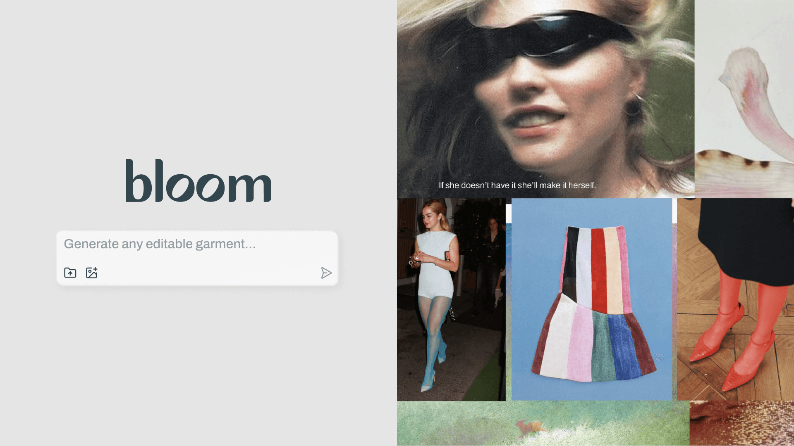
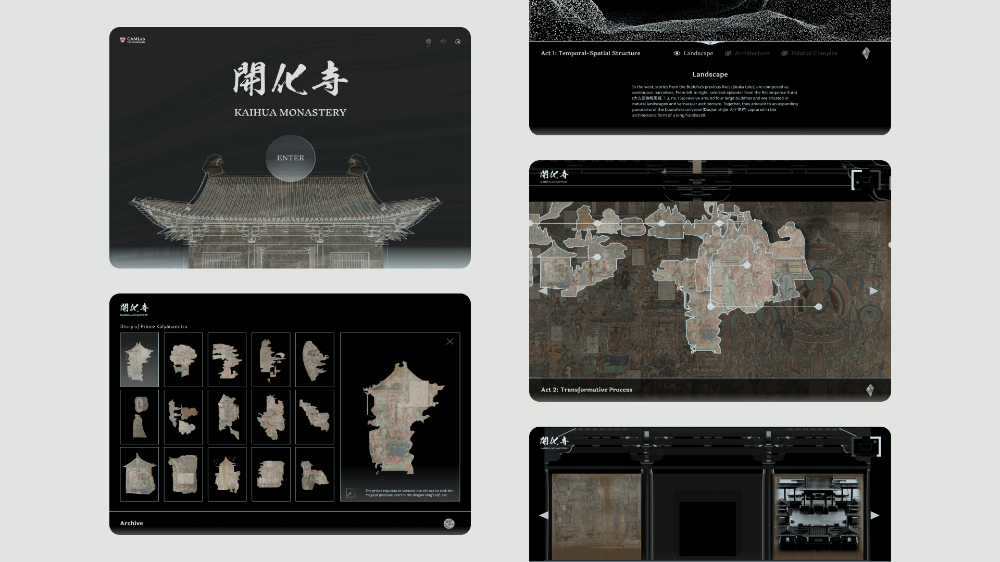

    
<h1>Case Studies</h1>

    

        <h2><a href="./projects/bloom/" style="text-decoration: none; color: black;">Bloom | AI-Native Design Tool</a></h2>
        
Building MVP: What happens when the product leads with a solution, not a problem?  *A fresh 2025 take. Text-heavy, narrative style.

    

    

        
    

    

        <h2><a href="./projects/weave/" style="text-decoration: none; color: black;">WEAVE | Web3 E-commerce</a></h2>
        
Shop NFT-backed phygital fashion in one click.

    

    

        <a href="./projects/weave/">
            <video src="./assets/images/weave_cover.mp4" alt="Weave - A marketplace for NFT-paired phygital fashion" autoplay loop muted playsinline style="width:100%; height:auto; display:block;"></video>
        </a>
    

    

        <h2><a href="./projects/digitaltemple/" style="text-decoration: none; color: black;"> Digital Temple | Ed Tech</a></h2>
        
An online classroom designed with Harvard, making complex simple.

            <a href="https://www.digitaltemple.art" 
               class="hide-mobile"
               style="display: inline-block; margin-top: 2em; padding: 0.2em 0.8em; font-size: 0.9em; background: #000; color: #fff; border-radius: 3px; text-decoration: none; font-weight: 500; border: none; transition: background 0.2s, opacity 0.2s;"
               onmouseover="this.style.background='rgba(128,128,128,0.4)';"
               onmouseout="this.style.background='#000';"
               target="_blank" rel="noopener">Visit Site ↗</a>
            
    

    

        
    

    
<h1>Client Work</h1>

    

        
        
        <h2><a href="https://www.kintsu.world/" style="text-decoration: none; color: black;"height: 200px">Kintsu.World</a></h2>
        
UI/UX design for web and mobile app to shop local merchants.

    

    

        
        
        <h2><a href="https://www.stevefagin.com/" style="text-decoration: none; color: black;">Artist Website</a></h2>
        
Design and development for Steve Fagin's personal website.

    

    

        
        
        <h2><a href="https://retireinequality.com/soccer/" style="text-decoration: none; color: black;">TIAA: Retire Inequality</a></h2>
        
Designed a soccer ball for TIAA.

    

  