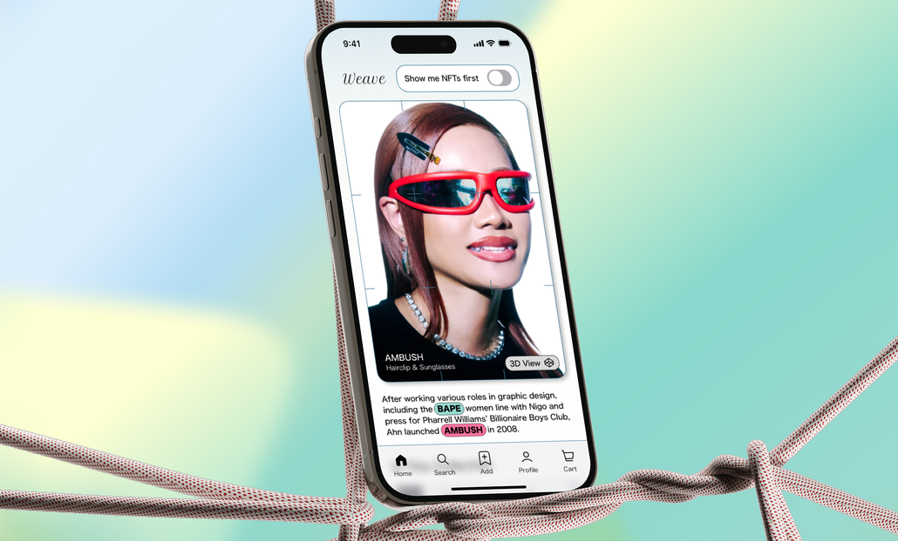
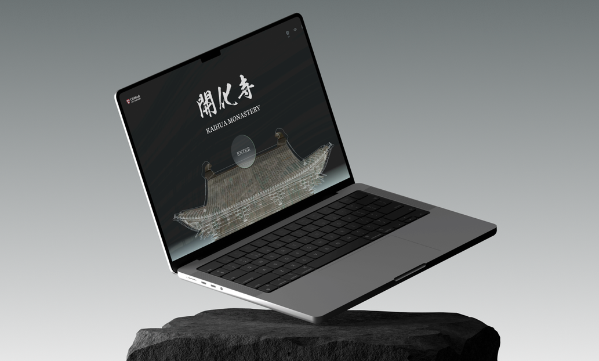
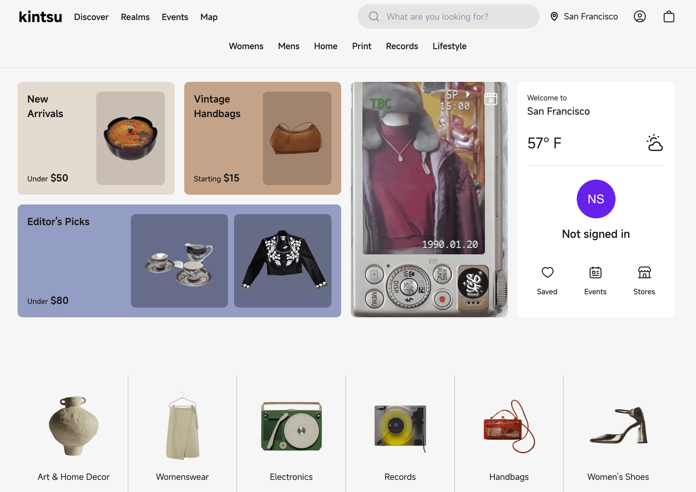
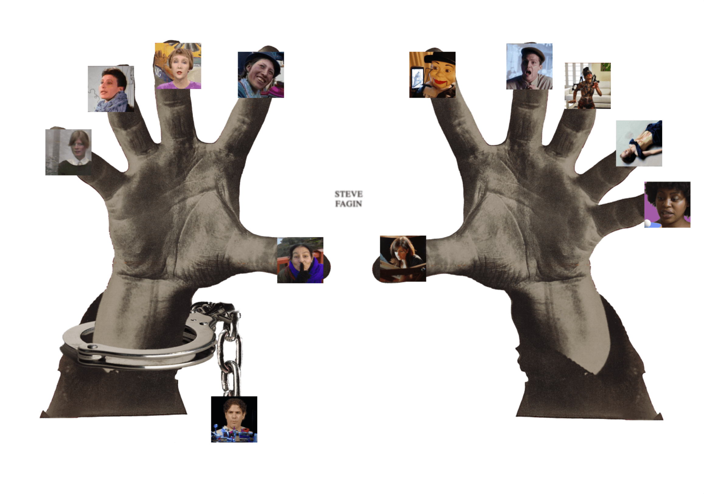
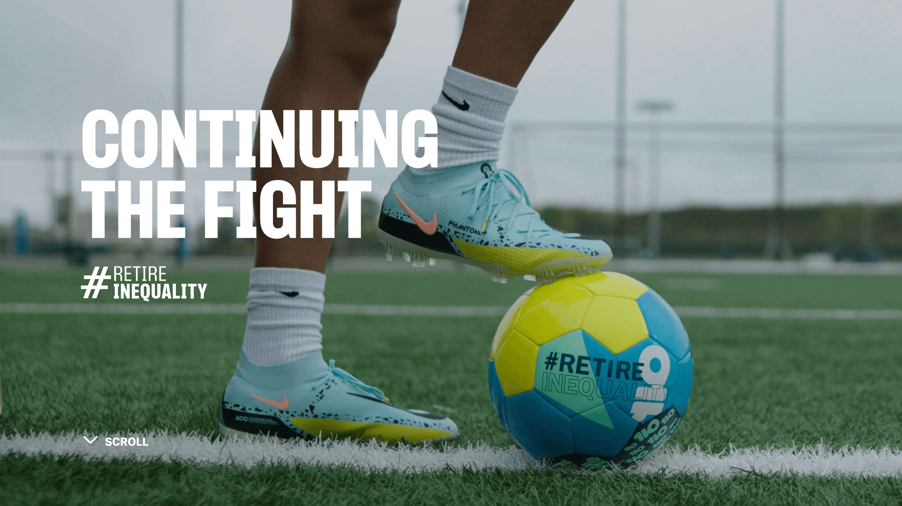
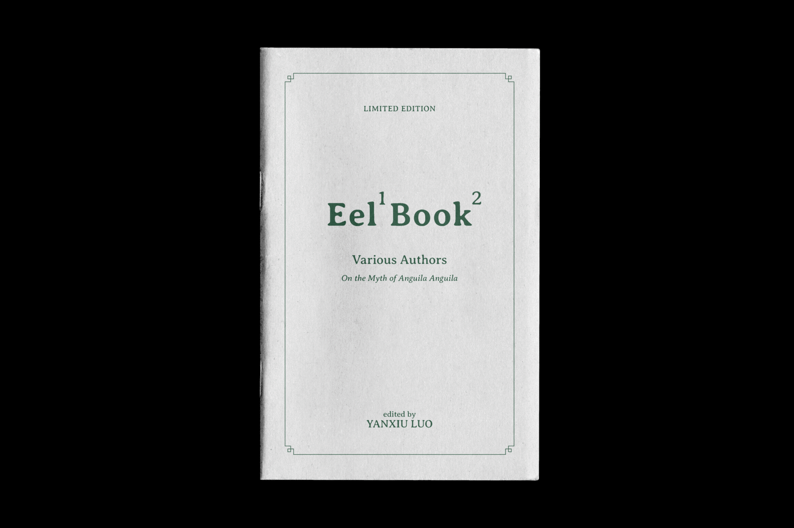

    
<h1>Case Studies</h1>

    

        <h2><a href="./projects/weave/" style="text-decoration: none">Web3 Social E-commerce</a></h2>
        
Product journey as story: layering complex data into a social UX

    

    

        
    

    

        <h2><a href="./projects/digitaltemple/" style="text-decoration: none">Online Learning Tool</a></h2>
        
Reimagining cultural heritage through immersive web design, made by and for Harvard University.

        
<a href="https://www.digitaltemple.art" target="_blank" rel="noopener noreferrer">See the live site↗</a>

    

    

        
    

    
<h1>Client Work</h1>

    

        
        <h2><a href="https://www.kintsu.world/" style="text-decoration: none; height: 200px">Kintsu.World</a></h2>
        
UI/UX design for web and mobile app to shop local merchants.

    

    

        
        <h2><a href="https://www.stevefagin.com/" style="text-decoration: none">Artist Website</a></h2>
        
Design and development for Steve Fagin's personal website.

    

    

        
        <h2><a href="https://retireinequality.com/soccer/" style="text-decoration: none">TIAA: Retire Inequality</a></h2>
        
Designed a soccer ball for TIAA.

    

    
<h1>Fun</h1>

    

        
        <h2><a href="https://allyyl.github.io/Keyboard/" style="text-decoration: none">Keyboard is the New Sexy</a></h2>
        
Websites about censorship and female nudity. Hand coded with JS/HTML/CSS.

    

    

        
        <h2><a href="https://www.youtube.com/watch?v=7n5AXpsue5k/" style="text-decoration: none">Water Simulation</a></h2>
        
An interactive water simulation created with TouchDesigner.

    

    

        
        <h2><a href="/" style="text-decoration: none">Eel Book</a></h2>
        
A zine about eels, comprised of a chain of footnotes.

    

  