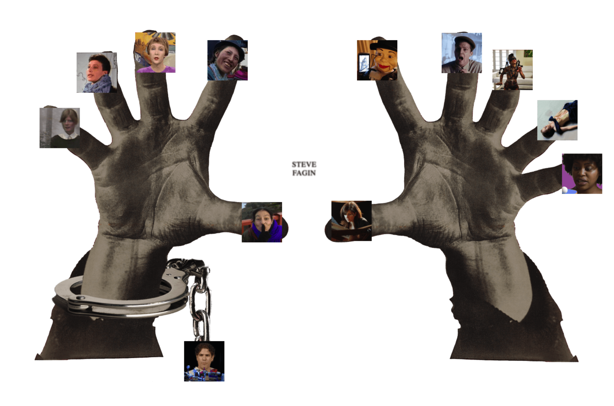
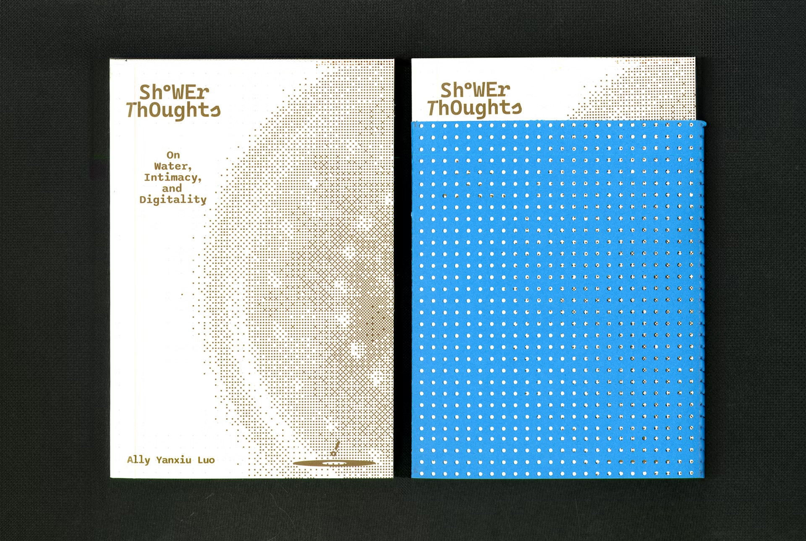

    
<h1>Case Studies</h1>

    

        <h2><a href="./projects/bloom/" style="text-decoration: none">Building an AI-Native Design Tool</a></h2>
        
Reflections from building Bloom's MVP: What happens when the product leads with a solution, not a problem? 

    

    

        
    

    

        <h2><a href="./projects/weave/" style="text-decoration: none">Web3 Social E-commerce</a></h2>
        
Shop phygital fashion, shareable NFT and low-friction checkout.

    

    

        
    

    

        <h2><a href="./projects/digitaltemple/" style="text-decoration: none">Digital Temple | Ed Tech</a></h2>
        
From sacred space to speculative UX, made by and for Harvard University.

        
<a href="https://www.digitaltemple.art" target="_blank" rel="noopener noreferrer">See the live site↗</a>

    

    

        
    

    
<h1>Client Work</h1>

    

        
        <h2><a href="https://www.kintsu.world/" style="text-decoration: none; height: 200px">Kintsu.World</a></h2>
        
UI/UX design for web and mobile app to shop local merchants.

    

    

        
        <h2><a href="https://www.stevefagin.com/" style="text-decoration: none">Artist Website</a></h2>
        
Design and development for Steve Fagin's personal website.

    

    

        
        <h2><a href="https://retireinequality.com/soccer/" style="text-decoration: none">TIAA: Retire Inequality</a></h2>
        
Designed a soccer ball for TIAA.

    

    
<h1>Creative Tech</h1>

    

        
        <h2><a href="./projects/shower" style="text-decoration: none">Shower Thoughts: on Water, Intimacy, and Digitality</a></h2>
        
A book, an installation, and a performence about the Internet

    

    

        
        <h2><a href="https://www.youtube.com/watch?v=7n5AXpsue5k/" style="text-decoration: none">Water Simulation</a></h2>
        
An interactive water simulation created with TouchDesigner.

    

    

        
        <h2><a href="https://vimeo.com/828694743?share=copy" style="text-decoration: none">Double Helix</a></h2>
        
3D animated film made with Cinema4D. Official Selection at Denver Digerati Experimental Media Festival.

    

  